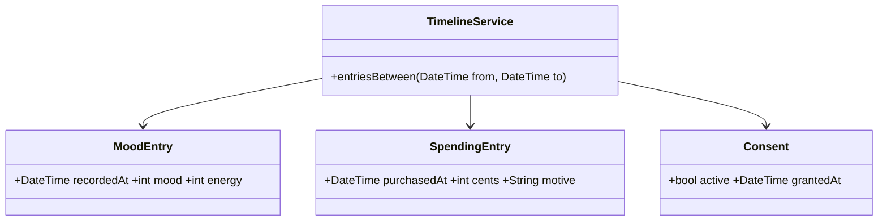

# C4 — Código

```mermaid
classDiagram
  class MoodEntry {+DateTime recordedAt +int mood +int energy}
  class SpendingEntry {+DateTime purchasedAt +int cents +String motive}
  class Consent {+bool active +DateTime grantedAt}
  class TimelineService {+entriesBetween(DateTime from, DateTime to)}
  TimelineService --> MoodEntry
  TimelineService --> SpendingEntry
  TimelineService --> Consent
```

