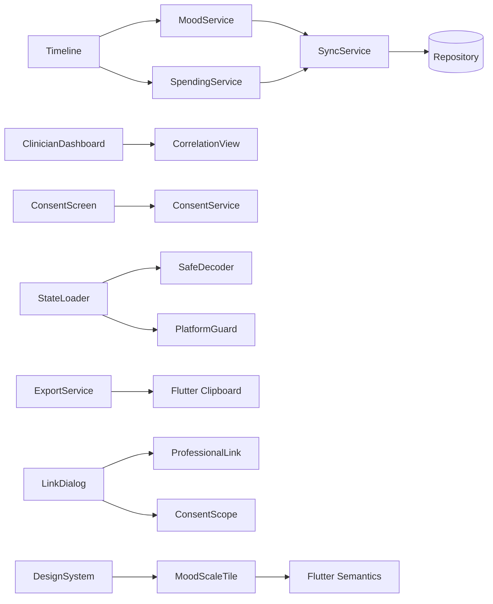

# C4 — Componentes

```mermaid
flowchart LR
  Timeline --> MoodService
  Timeline --> SpendingService
  ClinicianDashboard --> CorrelationView
  ConsentScreen --> ConsentService
  MoodService --> SyncService
  SpendingService --> SyncService
  SyncService --> Repository[(Repository)]
  StateLoader --> SafeDecoder
  StateLoader --> PlatformGuard
  ExportService --> Clipboard[Flutter Clipboard]
  LinkDialog --> ProfessionalLink
  LinkDialog --> ConsentScope
  DesignSystem --> MoodScaleTile
  MoodScaleTile --> Semantics[Flutter Semantics]
```
