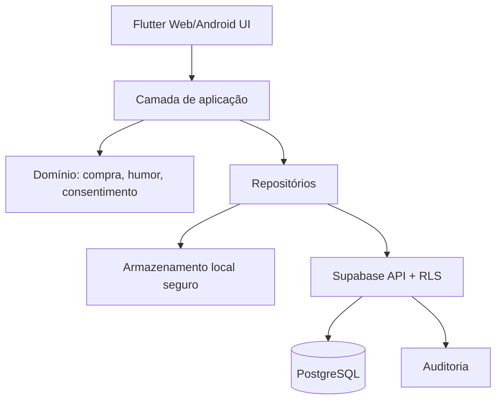

# C4 — Container

```mermaid
flowchart TB
  UI[Flutter Web/Android UI] --> APP[Camada de aplicação]
  APP --> DOM[Domínio: compra, humor, consentimento]
  APP --> REPO[Repositórios]
  REPO --> LOCAL[Armazenamento local seguro]
  REPO --> API[Supabase API + RLS]
  API --> DB[(PostgreSQL)]
  API --> AUD[Auditoria]
```

