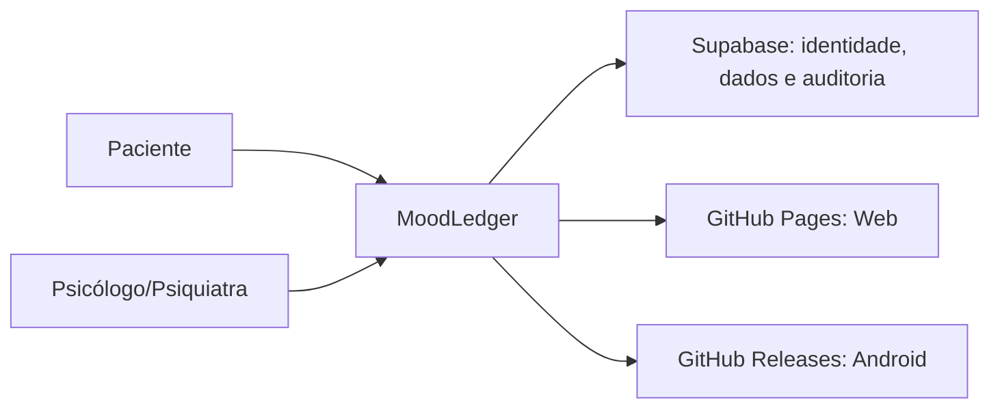

# C4 — Context

```mermaid
flowchart LR
  P[Paciente] --> M[MoodLedger]
  C[Psicólogo/Psiquiatra] --> M
  M --> S[Supabase: identidade, dados e auditoria]
  M --> G[GitHub Pages: Web]
  M --> R[GitHub Releases: Android]
```

O sistema apoia revisão longitudinal; não substitui julgamento clínico [R1–R3].

