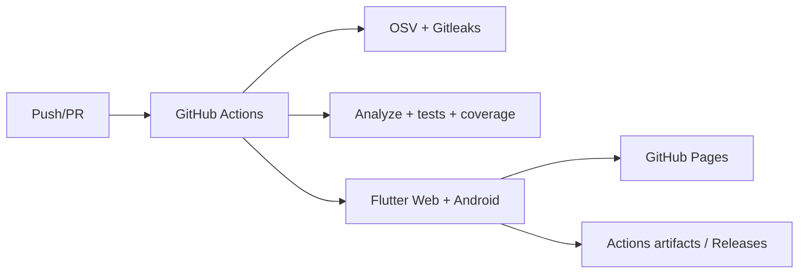

# C4 — Implantação

Qualquer falha em Security, Tests ou Builds bloqueia a publicação.

P0 operacional: falha → issue de incidente → branch corretiva → PR → checks verdes → atualização UML/C4 → promoção.
